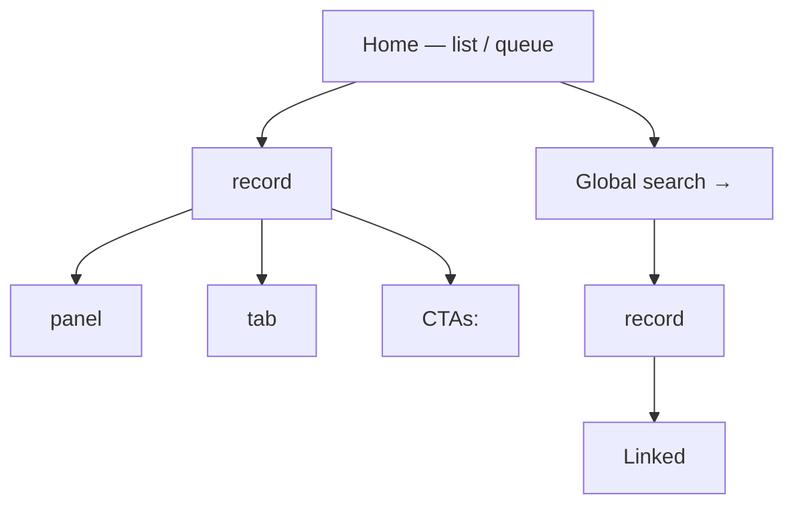

# IA Architect

Given an extracted object model, find the optimal information architecture for
the product — which object is the primary entry point, how others nest as
context, and why.

## Fixed target

> **The IA matches how actors actually trigger and progress through work —
> not how the domain is modelled in the real world.**

An ER model mirrors reality. An IA mirrors behaviour. These are different
optimizations; this skill does the second. A patient-centric ER model does not
imply a patient-centric IA.

## Scope

In: an object model (from `/extract`) + scenario/CTA source → IA recommendation.
Out: visual design, component spec, navigation implementation, copy.

If no object model exists in the `models/` directory, stop immediately and
tell the user to run `/extract` first.

## Inputs

1. Read the existing object model from `models/`.
2. Read the original scenario source if still available (same file used by
   `/extract`) — it carries the raw actor behaviour that the model abstracts.

## Process

### Progress lines — emit before each step

- `[Architect] Reading model…`
- `[Architect] Step 1 — Entry object analysis…`
- `[Architect] Step 2 — IA candidates…`
- `[Architect] Step 3 — Stress test…`
- `[Architect] Collecting forks…`
- `[Architect] Asking forks…` *(only if AskUserQuestion called)*
- `[Architect] Writing recommendation…`

---

### Step 1 — Entry object analysis

For **every object** in the model, answer these four questions:

| Question | What to look for |
|---|---|
| **Trigger** | Does a session start *because this object exists and needs action* (e.g. a task assigned to you)? Or does the actor navigate to it as a lookup to support action on something else? |
| **CTA density** | How many CTAs in the model live directly on this object? Objects with the most CTAs are the most action-dense. |
| **Lifecycle ownership** | Does this object carry a status that advances as work progresses (e.g. pending → in progress → closed)? Lifecycle owners are natural focal points. |
| **Cross-team handoff** | Does this object pass between teams as work advances, or does it stay with one team? Objects that cross teams define the shared work unit. |

Classify each object:

- **Primary** — triggers sessions, action-dense, owns the lifecycle, crosses teams. The IA should centre on this.
- **Context** — looked up to inform action on the Primary; few direct CTAs; stable while work happens.
- **Reference** — static catalogue data; consulted, rarely changed.

Produce a scored table. Be explicit when an object that looks "important" in
the domain model scores as Context in the IA (e.g. Patient may be central to
the ER model but Context in the IA if actors never start from it).

---

### Step 2 — IA candidates

Generate exactly **three** structural alternatives. Name each by its primary
object (e.g. "Task-centric", "Patient-centric", "Document-centric").

For each candidate write:

- **Entry point**: What the actor sees on load; what they navigate to first.
- **Context placement**: How Primary objects surface their Context objects
  (sidebar, tab, drawer, embedded panel, separate route).
- **Serves well**: Name one actor group whose workflow maps cleanly onto this
  structure.
- **Serves poorly**: Name one actor group for whom this structure adds friction.
- **Structural risk**: The one thing that breaks or becomes awkward if this IA
  is chosen at scale.

Do not invent candidates to fill the quota — if only two are genuinely
distinct, say so and explain why the third collapses into one of them.

---

### Step 3 — Stress test

Select the **3 most common or highest-stakes scenarios** from the source
(or from the CTA list in the model). Walk each scenario through each IA
candidate:

- Count navigation steps from load to first meaningful action.
- Note whether the required context (patient info, prescription status,
  prior notes) is visible without an extra lookup.
- Flag any step where the actor must hold information in their head because
  the IA does not surface it.

Summarise as a matrix:

| Scenario | Candidate A | Candidate B | Candidate C |
|---|---|---|---|
| <scenario> | N steps — <friction note> | … | … |

---

### Step 4 — Recommendation

State the recommended IA. No hedging. Support it with:

1. The entry object analysis result that drove the choice.
2. The stress-test result that confirms it.
3. The one real trade-off it makes — name who is underserved and state the
   mitigation (a secondary entry point, a search shortcut, a role-specific
   default view).

Produce a **containment / hierarchy diagram** in Mermaid showing how objects
nest in the recommended IA. This is not an ER diagram — it shows the UI
hierarchy: what is a screen, what is a panel, what is a tab, what is a
linked record.

---

## Gates — when to stop and use AskUserQuestion

1. **Two candidates are genuinely tied** on friction and serve different but
   equally important actor groups. Ask which actor group is the product's
   primary user before recommending.
2. **A structural assumption is unconfirmed.** If the recommendation requires
   something not in the model (e.g. "tasks always belong to exactly one
   patient") and it cannot be inferred, ask before proceeding.

Outside these gates, reason to a conclusion. Do not ask permission to have an
opinion.

---

## Output format

```
# IA Recommendation — <product name>

**Target:** The IA matches how actors actually trigger and progress through work.

## Entry object scoring

| Object | Trigger? | CTA density | Lifecycle? | Cross-team? | Classification |
|---|---|---|---|---|---|
| … | … | … | … | … | Primary / Context / Reference |

Key insight: <one sentence naming the Primary object and why the obvious
alternative — the domain-central object — scores as Context instead>

## IA candidates

### Option A — <Object>-centric
- **Entry point**: …
- **Context placement**: …
- **Serves well**: …
- **Serves poorly**: …
- **Structural risk**: …

### Option B — <Object>-centric
…

### Option C — <Object>-centric
…

## Stress test

| Scenario | Option A | Option B | Option C |
|---|---|---|---|
| … | N steps — note | … | … |

## Recommendation

**Option [X] — <Object>-centric**

<Two-sentence rationale citing entry object score and stress-test result.>

Trade-off: <who is underserved> — mitigated by <what>.

## Proposed UI hierarchy


```
