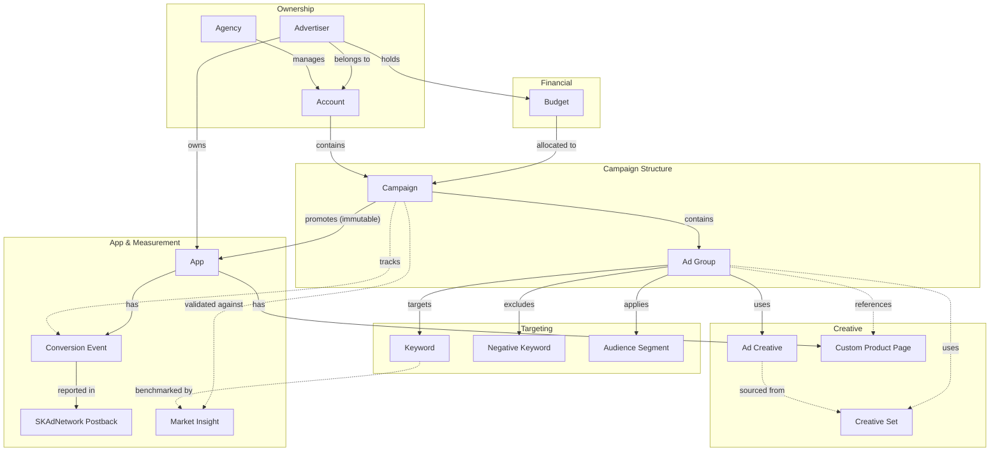
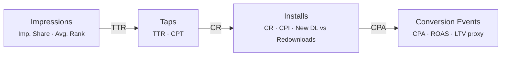

# Object Model — Apple Ads Industry

**Target:** The objects, their attributes, and their relationships mirror the real-world domain they represent.

---

## Objects

- **Account** — the top-level container; holds campaigns and is tied to billing
- **Advertiser** — the brand or company whose app is being promoted; owns Budgets and Apps
- **Agency** — manages one or more Accounts on behalf of Advertisers *(surfaced — not in input but required for the managed model)*
- **App** — the iOS/macOS/tvOS application being promoted; the immutable anchor of a Campaign
- **Budget** — a financial allocation that exists independently of any single Campaign; can be app-level, monthly, or annual; transferable across campaigns
- **Campaign** — a goal-scoped collection of Ad Groups that draws spend from a Budget; promotes exactly one App
- **Ad Group** — the targeting and bidding unit within a Campaign; references a placement, Audience Segment, Keywords, and Creatives
- **Ad Creative** — the ad unit shown to a user; format adapts to placement context (search unit / display banner / interstitial); can be auto-generated from App Store metadata (ASA Basic) or built from a Creative Set
- **Creative Set** — a curated collection of assets (screenshots, preview video, icon) used to assemble Ad Creatives
- **Keyword** — a search term with a match type and optional bid override, associated with an Ad Group
- **Negative Keyword** — an excluded search term applied at Campaign or Ad Group level to prevent unwanted matches
- **Audience Segment** — a defined targeting slice: customer type (new / returning / existing customers / users of my other apps), demographics, device, location
- **Conversion Event** — a named downstream action the advertiser defines and tracks (install, re-engagement, purchase, trial start, in-app event); has a conversion window and SKAdNetwork value mapping
- **Custom Product Page (CPP)** — an App Store variant page created in App Store Connect; referenced by Ad Groups to tailor the post-tap experience per audience or creative angle
- **SKAdNetwork Postback** — Apple's privacy-preserving attribution signal; issued by Apple, not configured by the marketer; carries a coarse/fine conversion value and is consumed by the advertiser's MMP *(system-level object — managed by developers, consumed indirectly by marketing managers as attribution data)*
- **Market Insight** — search popularity data, keyword suggestion scores, competitive impression-share benchmarks, and App Store category trends used to validate funnel performance *(surfaced — Apple and MMP-provided, not created by advertisers)*

**Not objects:**
- Ad Placement — a fixed enum attribute on Ad Group (Search Results / Today Tab / Search Tab / Product Pages – You May Also Like), not a managed instance
- Report / Dashboard — a view that assembles existing performance data; metrics live on Campaign and Ad Group

---

## Relationships

| | Account | Advertiser | Agency | App | Budget | Campaign | Ad Group | Ad Creative | Creative Set | Keyword | Neg. Keyword | Audience Segment | Conversion Event | CPP | SKAdN. Postback | Market Insight |
|---|---|---|---|---|---|---|---|---|---|---|---|---|---|---|---|---|
| **Account** | — | belongs to `many:1` | managed by `many:1` *(optional)* | — | — | contains `1:many` | — | — | — | — | — | — | — | — | — | — |
| **Advertiser** | | — | contracts with `many:many` | owns `1:many` | holds `1:many` | owns (via account) | — | — | — | — | — | — | — | — | — | accesses `1:many` |
| **Agency** | | | — | — | manages (on behalf) | manages `1:many` | — | — | — | — | — | — | — | — | — | — |
| **App** | | | | — | subject of `many:many` | promoted by `many:1` *(immutable)* | — | — | — | — | — | — | has `1:many` | has `1:many` | — | — |
| **Budget** | | | | | — | allocated to `1:many` | — | — | — | — | — | — | — | — | — | — |
| **Campaign** | | | | | | — | contains `1:many` | — | — | campaign-level negatives `1:many` | campaign-level negatives `1:many` | — | tracks `many:many` | — | — | validated against `many:many` |
| **Ad Group** | | | | | | | — | uses `many:many` | uses `many:many` | targets `many:many` | ad-group negatives `1:many` | applies `many:many` | — | references `many:1` *(optional)* | — | — |
| **Ad Creative** | | | | | | | | — | sourced from `many:1` *(optional)* | — | — | — | — | sourced from CPP `many:1` *(optional)* | — | — |
| **Creative Set** | | | | | | | | | — | — | — | — | — | — | — | — |
| **Keyword** | | | | | | | | | | — | — | — | — | — | — | benchmarked by `many:many` |
| **Neg. Keyword** | | | | | | | | | | — | — | — | — | — | — | — |
| **Audience Segment** | | | | | | | | | | | — | — | — | — | — | — |
| **Conversion Event** | | | | | | | | | | | | — | — | reported in `many:many` | — |
| **CPP** | | | | | | | | | | | | | — | — | — |
| **SKAdN. Postback** | | | | | | | | | | | | | links to `many:1` | — | — |
| **Market Insight** | | | | | | | | | | | | | | | — |

**Relationship notes:**
- **Campaign → App is immutable per instance.** Changing the promoted app means creating a new Campaign.
- **Budget is decoupled from Campaign.** Exists at Advertiser level, allocated across Campaigns, redistributable.
- **SKAdNetwork Postback is Apple-issued.** The advertiser defines the Conversion Event and its value mapping; Apple issues the Postback. Two distinct objects with different owners and lifecycles.
- **CPP lives in App Store Connect, referenced in Apple Ads.** The relationship is a cross-system reference; the CPP publish lifecycle belongs to App Store Connect.
- **Negative Keyword level (campaign vs. ad group) is a role on the relationship**, not a separate object type.

### Object map

*Solid arrows = primary structural relationships. Dashed = optional or secondary.*

---

## The Performance Funnel

Metrics are attributes of Campaign and Ad Group, organised as a funnel. Marketing managers read top-to-bottom to diagnose where value is being lost.

| Funnel Stage | Metrics on Campaign / Ad Group |
|---|---|
| **Reach** | Impressions, Impression Share (Share of Voice), Average Rank |
| **Engagement** | Taps, TTR (Tap-Through Rate), CPT (Cost Per Tap) |
| **Acquisition** | New Downloads, Redownloads, CR (Conversion Rate tap→install), CPI (Cost Per Install) |
| **Value** | Conversion Events, CPA (Cost Per Acquisition), ROAS (Return on Ad Spend), LTV proxy *(from MMP)* |
| **Spend health** | Spend, Budget Utilization (Spend ÷ Budget), daily pacing |
| **Attribution** | Attribution Rate (ASA-attributed vs. organic), SKAdNetwork postback volume |

---

## CTAs

**Marketing Manager / Campaign Manager:**
- *Campaign level:* Create Campaign, Duplicate Campaign, Pause / Resume Campaign, Set Budget allocation, Schedule Campaign (start/end date + dayparting), Archive Campaign
- *Bidding & keywords:* Add Keywords, Set Keyword Bid Override, Add Negative Keywords, Bulk Bid Adjustment, Enable / Disable Search Match
- *Ad Group level:* Create Ad Group, Define Audience Segment, Select Placement, Set Default CPT Bid, Assign Custom Product Page, Pause / Resume Ad Group
- *Creative:* Upload Creative Assets, Build Creative Set, Associate Creative to Ad Group
- *Optimization:* Reallocate Budget across Campaigns, Expand keyword list (from Search Match suggestions), Pause underperforming keywords, Test new CPP variant, Adjust audience targeting

**System (Apple Ads platform — no human CTA):**
Run search auction per query, apply keyword match types, apply audience targeting filters, pace delivery against daily/total budget caps, enforce ATT privacy rules, issue SKAdNetwork postbacks to MMP, calculate derived metrics (TTR, CPT, CPI, CR, CPA), apply bid floors, surface keyword suggestions via Search Match, generate Market Insight data

**Pre-existing (set before this behaviour, not CTAs here):**
App live on App Store; Custom Product Pages published in App Store Connect; SKAdNetwork SDK integrated in app binary (developer task); ATT opt-in/out from end user; MMP configured to receive postbacks

---

## Permissions (separate layer)

| Actor | View | Create / Edit | Delete / Archive |
|---|---|---|---|
| **Advertiser (direct)** | All objects in their Account | Campaign, Ad Group, Ad Creative, Keywords, Negative Keywords, Audience Segment, CPP assignment, Budget allocation | Campaign (archive), Ad Group, Keywords |
| **Agency** | All objects in managed Accounts | Same as Advertiser | Same as Advertiser — scoped to contracted accounts |
| **Developer / MMP** | SKAdNetwork Postback, Conversion Event mapping | Conversion Event value mapping | — |
| **Apple (system)** | All auction signals | SKAdNetwork Postback (issues it), Market Insight | — |

---

## Attributes

**Account**
Core: name, currency, billing time zone, payment method
Metadata: account ID, status (active / suspended), billing threshold, created date

**Advertiser**
Core: company name, industry vertical, primary contact
Metadata: advertiser ID, account IDs, MMP partner(s)

**Agency**
Core: agency name, contact, managed advertiser list
Metadata: agency ID, contract terms

**App**
Core: app name, bundle ID, App Store ID, supported platforms (iOS / macOS / tvOS)
Metadata: App Store category, supported storefronts / regions

**Budget**
Core: total amount, time period (monthly / annual / flight), currency, app scope
Metadata: budget ID, remaining balance, utilization %, allocation across campaigns, status (active / exhausted / transferred), created date

**Campaign**
Core: name, objective (app installs / app re-engagements / product page views), promoted app *(immutable)*, budget allocation, placement type, start/end date, dayparting schedule
Metadata: campaign ID, status (running / paused / on hold / ended / deleted), delivery status, created date
Funnel metrics: Impressions, Taps, TTR, New Downloads, Redownloads, CR, Spend, CPI, CPA, ROAS, Budget Utilization, Impression Share, Attribution Rate

**Ad Group**
Core: name, default max CPT bid, placement (Search Results / Today Tab / Search Tab / Product Pages), targeting (location, device, age range, gender, customer type), assigned CPP
Metadata: ad group ID, status, created date
Funnel metrics: same scalar set as Campaign, scoped to this ad group

**Ad Creative**
Core: creative assets (screenshots, preview video, icon), headline, subheadline, CTA text, format (standard search unit / display banner / interstitial)
Metadata: creative ID, status (active / paused), auto-generated flag, source creative set

**Creative Set**
Core: asset library (images, video, icon variants), name
Metadata: creative set ID, asset count, last updated

**Keyword**
Core: keyword text, match type (broad / exact), bid override, status (active / paused / removed)
Metadata: keyword ID, created date, source (manual / Search Match suggestion)
Metrics: Impressions, Taps, TTR, Installs, CPT, CPI, Average Rank

**Negative Keyword**
Core: keyword text, match type (broad / exact), level (campaign / ad group)
Metadata: created date

**Audience Segment**
Core: segment type (new users / returning users / existing customers / users of my other apps), demographic filters (age range, gender), location, device type
Metadata: estimated reach, segment ID

**Conversion Event**
Core: event name, event type (install / re-engagement / purchase / trial / in-app event), conversion window (1–30 days), SKAdNetwork conversion value mapping (0–63)
Metadata: event ID, MMP source, status (active / paused)

**Custom Product Page**
Core: page name, promotional text, screenshots set, preview video, associated app
Metadata: App Store Connect page ID, URL, publish status (draft / published), created date

**SKAdNetwork Postback** *(system-level; consumed by MMP, not managed by marketing manager)*
Core: conversion value (coarse 0–2 or fine 0–63), install timestamp, redownload flag, source app ID
Metadata: postback ID, Apple-assigned campaign ID, privacy threshold status (met / not met)

**Market Insight**
Core: keyword search popularity score, category benchmark CPT/CPI, share-of-voice data, keyword suggestions
Metadata: data source (Apple / MMP / third party), data freshness date, applicable storefront

---

## Judgment calls

- **Budget** is a standalone object — preserves budget portability and app-level / time-period scoping that mirrors real advertiser operations.
- **Ad Placement** is an attribute on Ad Group (a fixed enum), not a managed object — marketing managers select from it, they don't create instances of it.
- **Report is not an object.** Metrics are attributes on Campaign and Ad Group. Actionable results live on the objects themselves; reports are ephemeral views.
- **SKAdNetwork Postback** remains in the model as a system-level object because it is structurally distinct from the Conversion Event (different owner, different lifecycle) — but it is developer-managed; marketing managers consume it indirectly via MMP dashboards.
- **Custom Product Page** is first-class: it has its own publish lifecycle in App Store Connect and is referenced by Ad Groups for targeting and creative testing.
- **Funnel stages** (Impression → Tap → Install → Conversion Event) are metric attributes on Campaign/Ad Group, not event objects — matching how marketing managers diagnose and act on performance data.
