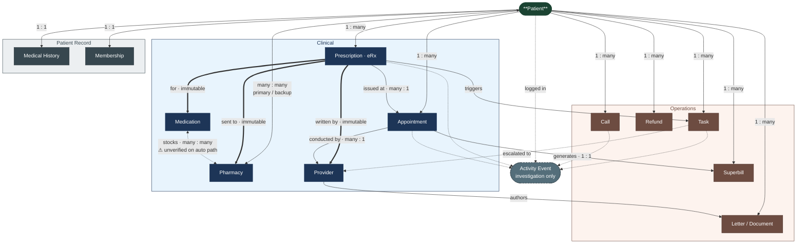

# Object Model — MEDvidi Healthcare Telemed CRM

**Target:** The objects, their attributes, and their relationships mirror the real-world domain they represent.

---

## Schema

> **Edge key:** `==>` immutable binding (cancel + new instance to change) · `-->` structural relationship · `-.->` optional / escalation / logging · `<-->` bidirectional role

---

## Objects

- **Patient** — person enrolled in care; the central subject of most workflows
- **Prescription (eRx)** — a single electronic prescription for one medication, issued to a specific pharmacy; immutable per pharmacy instance
- **Medication** — the drug being prescribed (e.g., ALPRAZolam 0.5mg, Adderall 5mg)
- **Pharmacy** — dispenses prescriptions; plays the role of *primary* or *backup* on a patient's profile
- **Task** — a discrete work item with owner, priority, and lifecycle; one polymorphic type covering all issue categories (prescription issue, quality audit, refund, admin, etc.)
- **Appointment** — a scheduled encounter between patient and provider
- **Provider** — licensed clinician who sees patients, issues prescriptions, and reviews clinical tasks
- **Superbill** — itemized billing document generated for patient or out-of-pocket reimbursement
- **Letter / Document** — clinical or admin document (ESA letter, discharge note, accommodation, subpoena response, fax)
- **Refund** — financial reversal issued to a patient
- **Call** — a phone call record (inbound or outbound)
- **Medical History** — longitudinal health record: diagnoses (ICD codes), past prescriptions, clinical documents
- **Membership** — patient's subscription/plan with MEDvidi
- **Activity Event** *(surfaced)* — structured log entry recording human or system actions on a patient record; used specifically for investigating what happened to a patient in edge/escalation cases

---

## Relationships

Systematic pairwise check. Non-null relationships only; `—` = no meaningful relationship.

| | Patient | Prescription | Medication | Pharmacy | Task | Appointment | Provider | Superbill | Letter | Refund | Call | Medical History | Membership | Activity Event |
|---|---|---|---|---|---|---|---|---|---|---|---|---|---|---|
| **Patient** | — | has `1:many` | prescribed via Rx | prefers `many:many` *(role: primary/backup)* | subject of `1:many` | attends `1:many` | seen by `many:many` | receives `1:many` | receives `1:many` | receives `1:many` | party to `1:many` | has `1:1` | holds `1:1` | has `1:many` |
| **Prescription** | — | — | is for `many:1` | sent to `many:1` ⚠️ immutable | triggers `1:many` | issued at `many:1` | written by `many:1` ⚠️ immutable | — | — | — | — | recorded in | — | logged in `1:many` |
| **Medication** | — | — | — | stocked by `many:many` ⚠️ | — | — | — | — | — | — | — | referenced in | — | — |
| **Pharmacy** | — | — | — | — | — | — | — | — | — | — | — | — | — | — |
| **Task** | — | — | — | — | — | — | assigned to `many:1` | — | — | — | — | — | — | logged in `1:many` |
| **Appointment** | — | — | — | — | — | — | conducted by `many:1` | generates `1:1` | — | — | — | recorded in | — | logged in `1:many` |
| **Provider** | — | — | — | — | — | — | — | — | authors `1:many` | — | — | — | — | — |
| **Superbill** | — | — | — | — | — | — | — | — | — | — | — | — | — | — |
| **Letter** | — | — | — | — | — | — | — | — | — | — | — | — | — | — |
| **Refund** | — | — | — | — | — | — | — | — | — | — | — | — | — | — |
| **Call** | — | — | — | — | — | — | — | — | — | — | — | — | — | logged in `1:many` |
| **Medical History** | — | — | — | — | — | — | — | — | — | — | — | — | — | — |
| **Membership** | — | — | — | — | — | — | — | — | — | — | — | — | — | — |

**Notes:**

- ⚠️ **Prescription → Pharmacy** is **immutable per instance.** Changing the pharmacy means canceling the existing eRx and issuing a new one. This is not an edit — it produces a new Prescription object.
- ⚠️ **Prescription → Provider** is immutable per instance (the issuing provider is fixed at write time).
- ⚠️ **Pharmacy ↔ Medication (`stocks`)** is load-bearing for backup pharmacy routing. Two paths exist:
  - **Manual path**: support agent verifies stock directly with the backup pharmacy before routing; only applies to certain task categories.
  - **Automatic path**: prescription is canceled automatically and sent to the prescriber in EHR with no stock verification; risk of the backup pharmacy not carrying the medication is accepted.
- **Primary / Backup pharmacy** are roles on the *Patient ↔ Pharmacy* relationship, not separate object types.

---

## CTAs

**Support Agent (Tier 1)**
- Verify patient identity (call)
- Pick up / start task
- Log prescription issue (wrong name, unable to fill, out of stock, not received)
- Verify backup pharmacy stock *(manual path only — certain task categories)*
- Assign task to provider
- Send SMS to patient
- Close task
- Reschedule appointment
- Confirm appointment
- Send appointment link
- Send ESA letter
- Send accommodation letter (sick leave, etc.)
- Respond to subpoena
- Create Superbill
- Initiate refund
- Log call
- Escalate to Tier 2 / MedOps

**Support Agent (Tier 2 / MedOps)**
- Handle escalated prescription issue
- Audit call / email quality
- Resolve billing discrepancy
- Manage refund review

**Provider**
- Review re-prescription request (in EHR)
- Approve re-prescription → issue new eRx to backup pharmacy
- Reject re-prescription + leave note (reason)
- Issue new Prescription (eRx)
- Author Letter (ESA, discharge, accommodation, Good Faith dispensation)

**Administrative Assistant**
- Verify patient identity (call)
- Reschedule appointment
- Answer subpoena
- Send accommodation letters

**Sales Agent**
- Follow up with prospective patient
- Convert prospect to Patient

**Patient**
- Submit prescription issue (portal)
- Call support
- Request appointment reschedule

**System (automated — not human CTAs)**
- Set prescriptions to *Cancel Requested* when patient submits pharmacy issue
- Start 5-minute timeout clock on Cancel Requested status
- Transition status: *Cancel Requested → No Response* after timeout with no pharmacy response
- Create support Task after timeout
- Transition status: *Cancel Requested → Canceled* when pharmacy approves cancellation
- Create EHR Task for provider *(automatic path)* when pharmacy approves cancellation
- Log all state changes as Activity Events
- Notify assigned support agent when provider responds

**Pre-existing state (not CTAs here)**
- Backup pharmacy already set on patient profile before issue occurs
- Prescription already linked to primary pharmacy at time of issue

---

## Permissions (separate layer)

| Actor | Patient | Prescription | Task | Appointment | Medical History | Superbill | Letter | Refund | Call | Membership |
|---|---|---|---|---|---|---|---|---|---|---|
| **Support Agent T1** | read | read + status update | read/write/close | read + schedule | read | read + generate | read + send | read + initiate | read + log | read |
| **Administrative Asst.** | read | read | read/write | read + schedule | read | — | read + send | — | read + log | read |
| **Provider** | read | read + write (new) | read + update | read | read + write | — | write | — | read | — |
| **Sales Agent** | read (pre-enrolment) | — | read/write (own) | read + schedule | — | — | — | — | read | — |
| **MedOps** | read | read | read/write | read | read | read | read | read/write | read | read |
| **Finance** | read (billing fields) | — | read | — | — | read/write | — | read/write | — | read |
| **Patient** | read/write (own) | read | — | read + request | read (own) | read (own) | read (own) | request | — | read (own) |

---

## Attributes

**Patient**
- Core: First Name, Last Name, DOB, Gender, Email, Phone, State, ZIP, Timezone
- Metadata: status (Active / Inactive), created date

**Prescription (eRx)**
- Core: Medication, Dosage, Quantity, Issuing Provider, Issue Date, Destination Pharmacy, Appointment reference
- Metadata: status (`Active → Cancel Requested → No Response → Canceled / Canceled Manually / Rejected by Provider`)

**Medication**
- Core: Name, Strength, Form (pill, liquid, etc.), Quantity unit

**Pharmacy**
- Core: Name, Store Number, Address, Phone
- Metadata: *(role — Primary / Backup — lives on Patient ↔ Pharmacy relationship, not on Pharmacy itself)*

**Task**
- Core: Title, Description / Instructions, Category (Prescription Issue / Quality Audit / Refund / Admin / Other), Priority, Linked Patient, Linked Prescription
- Metadata: status (`To Do → In Progress → On Hold → Assigned to Provider → Completed / Pending`), assigned agent, created by (System / Human), created at, rejection reason (when applicable)

**Appointment**
- Core: Date/Time, Provider, Type (initial, follow-up, etc.)
- Metadata: status (Scheduled / Confirmed / Completed / Canceled)

**Provider**
- Core: Name, Specialty, License
- Metadata: linked EHR account

**Superbill**
- Core: Patient, Provider, Service Date, Procedures (CPT codes), Diagnoses (ICD codes), Amount
- Metadata: generated date, delivered status

**Letter / Document**
- Core: Type (ESA / Discharge / Accommodation / Subpoena Response / Good Faith Dispensation / Fax), Content, Author, Recipient
- Metadata: sent date, delivery channel (Email / Fax / Portal)

**Refund**
- Core: Amount, Reason, Linked Patient
- Metadata: status (Requested / Approved / Issued), issued date

**Call**
- Core: Direction (Inbound / Outbound), Duration, Phone Number, Agent
- Metadata: status (Answered / Missed), date/time, recording link

**Medical History**
- Core: Diagnoses (ICD codes), Past prescriptions, Visit summaries, Clinical documents, Preferred pharmacy
- Metadata: last updated

**Membership**
- Core: Plan Type, Start Date, Billing Info
- Metadata: status (Active / Expired / Paused), renewal date

**Activity Event** *(surfaced — investigation use only)*
- Core: Timestamp, Actor (System / Agent / Provider), Description, Affected object(s), Status transition (from → to)
- Metadata: event type (Main Event / System Event / Active Task), priority flag

---

## Judgment Calls

1. **Lead removed by design decision.** The entity existed in the UI nav but could not be cleanly defined. Removed from the model pending a clearer domain definition; a prospective patient is currently outside the model's scope.

2. **Task as single polymorphic object.** All issue types (prescription, quality audit, refund, admin) share the same lifecycle and owner structure. If specific task categories require materially different attributes or permissions, they may warrant separate objects — monitor as the model develops.

3. **Activity Event scope is narrow.** Retained as an object because it is the only mechanism for investigating what happened to a patient in edge/escalation cases. It is not a general-purpose log visible to all actors in all flows.

4. **Pharmacy stock verification has two paths with different risk profiles.** The manual path (agent verifies before routing) mitigates the risk of the backup pharmacy not carrying the medication. The automatic path (EHR sends without verification) accepts that risk. Both paths are modeled as behaviors of the same Pharmacy ↔ Medication relationship — no new object needed, but the two paths imply different Task categories.

5. **Communication channels are SMS, Call, and Email only.** Intercom is being removed. eFAX remains as a delivery channel for Letters/Documents, not a standalone domain object. The Call object covers phone records; SMS and Email are attributes/channels on outbound communications from Task actions, not separate objects.
